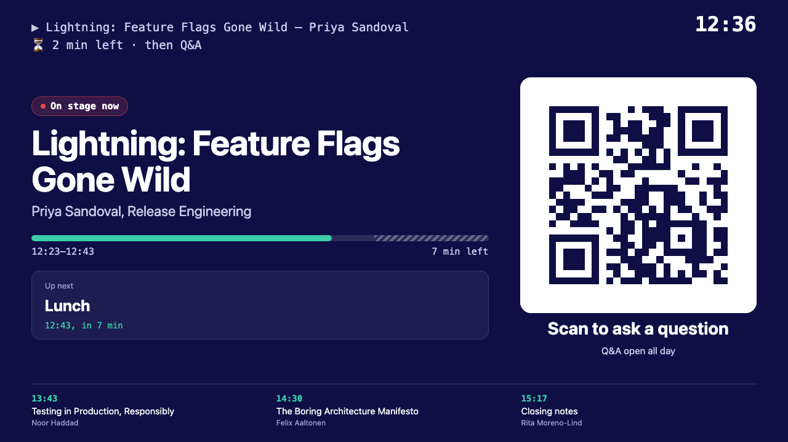
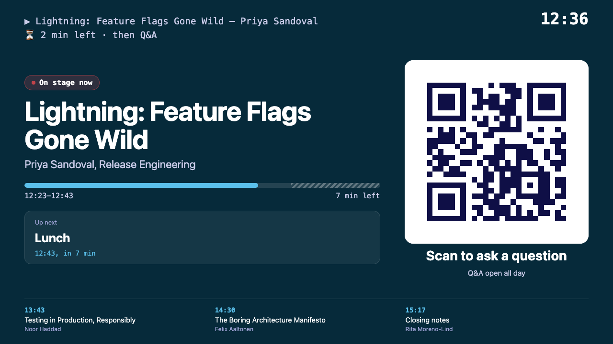
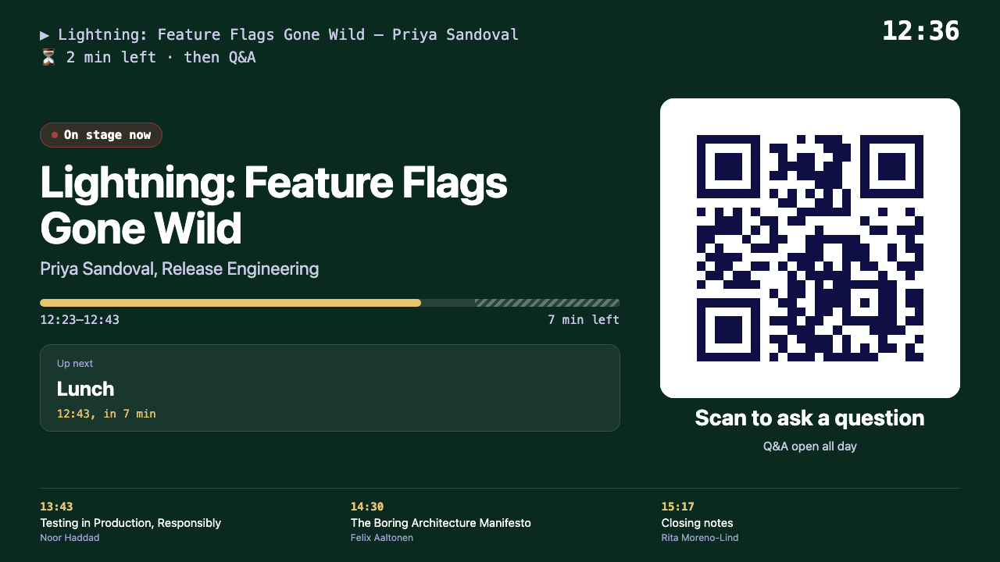
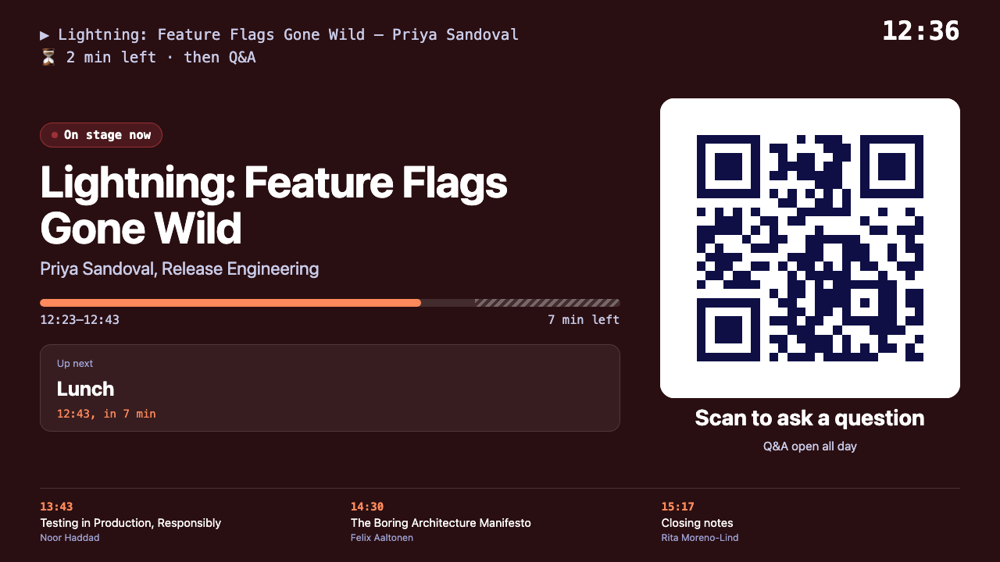
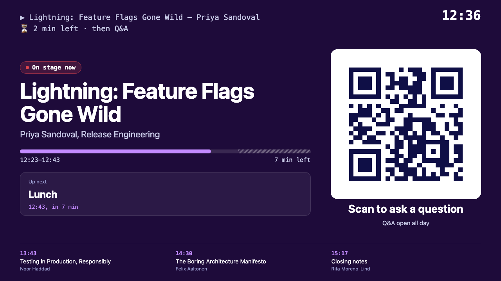
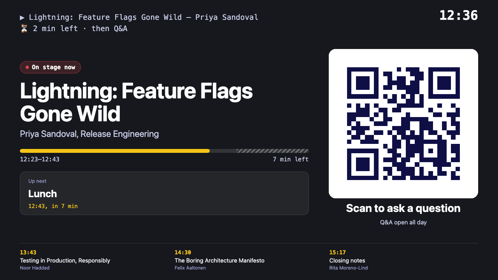

# OnAir

**A live agenda, presentation screen and speaker timer for single-track events, driven by one JSON file.**

OnAir shows attendees what's on stage right now, keeps the room screen in sync with the schedule, and gives
speakers a countdown they can't miss. When the day doesn't go to plan, you fix the schedule from a small
local admin page and every screen follows within seconds.

No build step, no framework, no database: two static HTML pages, one `agenda.json`, and an optional
zero-dependency Node.js server for editing on the day. It was first used at a one-day tech conference, where
talks were added, moved and re-timed live without anyone in the audience noticing.

**Demo:** https://gadominas.github.io/OnAir/ (try `?sim=09:30`, and press `P` for presentation mode)


## What's in the box

| Screen | For | What it does |
|---|---|---|
| **Live agenda** (`index.html`) | Attendees, on phones and laptops | Countdown before the event, what's on stage now with a progress bar, what's next, the full agenda grouped into acts, and big **Watch live** and **Ask a question** buttons. |
| **Presentation mode** (`index.html`, press `P`) | The audience, on a projector or TV | The big version: current talk, a large clock, a "scan to ask" QR code, the next sessions, and an animated [terminal](#the-terminal) that runs funny commands between talks and shows the talk, presenter and time left while someone is on stage. |
| **Speaker timer** (`timer.html`) | The speaker, on a confidence monitor | A huge countdown that turns amber at 5 min, orange at 2 and red in the last minute, then blinks **STOP** when talk time is up and counts down the Q&A. |
| **Admin** (`admin/`) | The organiser, on their laptop | Edit, drag to reorder, and re-time sessions. **"Start it now"** shifts the rest of the day when a talk starts late. Set the event name, logo and [colour palette](#palettes), the Q&A and livestream links, and generate the Q&A QR code as SVG or PNG for slides and posters. Open the agenda, presentation or timer in one click, or get their network addresses and QR codes for other devices. It saves to `agenda.json` and can publish to GitHub Pages. |

| Live agenda | Speaker timer, 5 minutes left |
|---|---|
|  |  |


## Quick start

You need [Node.js](https://nodejs.org) 18 or newer, and nothing else: there are no npm packages to install.
`./onair.sh setup` checks this and, if Node.js (or `lsof`, which the script uses) is missing, offers to install it
with Homebrew on macOS or your Linux package manager. `start` runs the same check automatically.

```bash
git clone https://github.com/gadominas/OnAir.git
cd OnAir
./onair.sh start        # or: node admin/server.mjs (foreground)
```

Run `./onair.sh` on its own for a small menu: start, stop, restart, status, logs, open the admin, agenda
or timer in your browser, change the port, and check prerequisites. The commands also work directly:
`./onair.sh start | stop | restart | status | logs | run | setup`. The server runs in the background, so it keeps
going when you close the menu. If another program already holds the port, OnAir asks whether to stop it.
In scripts or CI, `ONAIR_KILL=1` answers that question with yes, and `ONAIR_YES=1` installs prerequisites without asking. Settings such as `PORT=8080 ./onair.sh start` pass through to the server.

| Open | |
|---|---|
| http://localhost:4242/ | Live agenda (press `P` for presentation mode) |
| http://localhost:4242/timer.html | Speaker timer |
| http://localhost:4242/admin/ | Admin (only from this computer) |

The demo agenda is set on a future date, so to see it live, pretend it's a moment on the event day:
http://localhost:4242/?sim=09:30 (add `&speed=10` to watch time run faster). Every page accepts this.

## Make it your event

1. **Edit `agenda.json`**, by hand or in the admin. Set your event's name, date, time zone, sessions and links. The reference is below.
2. **Rehearse** any moment with `?sim=HH:MM`, or with the "Test the live view" button in the agenda's footer.
3. **Publish** the agenda for attendees on any static host. With GitHub Pages:
   - Fork or push this repository to GitHub.
   - In **Settings → Pages → Build and deployment**, set **Source** to **GitHub Actions**. The included workflow deploys every push to `main`.
   - Your agenda is then at `https://<you>.github.io/<repo>/`.

### On the day

- **Run the room screens from your laptop** with `./onair.sh start`. Screens on the venue network open the presentation and timer pages at the network address the server prints (for example `http://192.168.1.20:4242/timer.html`). They read your local `agenda.json`, so changes reach them within seconds, with no deploy. Other devices get read-only access; the admin page and its API only answer on the laptop itself.
- **Re-time from the admin.** If a speaker isn't ready, press **"Started late? Start it now"** when they begin. That session moves to the current minute and everything after it shifts. The **decision panel** under the admin's header stays in view while you scroll: **"+5 min talk…"** (in the last 5 minutes before Q&A) and **"+5 min Q&A…"** (during Q&A) extend the running talk, and **"−5 min from…"** wins time back. Each opens a picker listing every later talk and break (lunch included) with a preview of the new times: pick the slot that gives up the minutes (5, 10 or 15) so the rest of the day stays on time, or don't borrow and let it run later. Tick **"Catch up"** to take the delay out of the next break instead.
- **Publish** pushes `agenda.json` to GitHub (commit, pull with rebase, push), and open attendee pages pick the change up on their own. Batch edits rather than publishing after every small change, since each publish triggers a deploy.

## `agenda.json`

```jsonc
{
  "event": {
    "name": "OnAir Demo Day 2027",
    "brand": { "title": "OnAir", "number": "Demo" },   // header wordmark; "number" is optional
    "logo": "",                                       // optional image URL or path; replaces the pixel mark
    "city": "Lisbon",
    "date": "2027-05-20",                             // the event day
    "timeZone": "Europe/Lisbon",                      // for displaying times
    "utcOffset": "+01:00",                            // the offset on that day (mind daylight saving)
    "timeZoneNote": "Lisbon time (WEST, UTC+1)",
    "venue": "Example Hall, Rua do Exemplo 42, Lisbon.",
    "dateText": "Thursday 20 May 2027",
    "organizer": "Your Organisation"
  },
  "links": {                     // both optional; an empty link hides its buttons. Also editable in the admin.
    "qa": "https://…",           // the one Q&A link: Ask buttons (open it in a new tab) and the QR code
    "stream": "https://…"        // "Watch live" buttons
  },
  "theme": { "preset": "midnight" },   // a palette (see Palettes), optionally with single colours overridden
  "labels": {                    // all optional: texts for another language or style
    "act": "Act",                // the word before act numbers ("Track", "Part", …)
    "ask": "Ask a question", "watch": "Watch live",
    "qrTitle": "Scan to ask a question", "qrNote": "Q&A open all day"
  },
  "cli": {                       // the animated terminal (see The terminal); all optional
    "command": "onair --city",
    "guesses": ["porto", "madrid", "paris"],   // typed and deleted before the answer
    "answer": "lisbon",                        // default: the city in lowercase
    "jokes": true,                             // true = the inventory in cli-commands.json, false = none, or your own list
    "exitCode": 42,
    "enabled": true
  },
  "timing": { "talkMinutes": 35, "qaMinutes": 7, "changeoverMinutes": 5 },
  "acts": { "1": "Faster, smaller, clearer", "2": "Shipping it" },
  "sessions": [
    { "start": "09:00", "dur": 10, "kind": "keynote", "title": "Opening", "who": "Rita Moreno-Lind", "role": "Host" },
    { "start": "09:10", "dur": 42, "kind": "talk", "act": 1, "title": "The Latency Budget",
      "who": "Tomas Varga", "role": "Platform Engineer", "desc": "One or two sentences." },
    { "start": "10:39", "dur": 10, "kind": "break", "title": "Coffee break" },
    { "start": "12:23", "dur": 20, "kind": "talk", "act": 2, "title": "Lightning talk", "qa": 5 }
  ]
}
```

| Session field | Notes |
|---|---|
| `start`, `dur` | `"HH:MM"` in the event's local time, and minutes. |
| `kind` | `talk`, `break` or `keynote`. Breaks are titled exactly `Coffee break` or `Lunch` (that picks the icon and labels). |
| `qa` | Talks only. Q&A minutes at the end of the slot; the talk part is the rest. Defaults to `timing.qaMinutes`, so a 42-minute talk is 35 + 7 and a 20-minute talk is 13 + 7. |
| `act` | Talks only. Groups talks under an act heading from `acts`. |
| `who`, `role`, `desc` | Speaker, their role or team, and a short description. |

**Scheduling convention.** Sessions follow each other back to back, with a changeover (`timing.changeoverMinutes`)
after a talk unless a break comes next. The changeover isn't a session; it exists only as the gap between start
times, and the screens show "Up next" with a countdown during it. The admin keeps this for you. When editing by
hand, the checks in [AGENTS.md](AGENTS.md) tell you whether the times still line up.

## Palettes

Pick a palette in the admin (**Branding** panel) or in `agenda.json` with `"theme": { "preset": "<name>" }`. Midnight,
the blue palette, is the default. Any single colour can be overridden on top of a palette: `"ink"` (background),
`"navy"` (secondary), `"accent"` (buttons, bars, countdowns) and `"accentInk"` (the accent on light backgrounds).
The palettes live in [themes.mjs](themes.mjs), so adding your own takes one line.

**Or generate one from your artwork.** In the admin's Branding panel, drop in a key visual, poster or logo (or click
"Analyse the event logo"). OnAir finds its dominant colours right in the browser (nothing is uploaded), shows them with
their share of the image, and builds a palette from them: a deep version of the main hue as the background, the most
vivid colour as the accent, and contrast checks so white text stays readable on the background and the accent stays
readable on the light agenda page. Click any detected colour to make it the accent, look at the preview, and apply it.
It's saved as `"theme": { "preset": "custom", "ink": …, "navy": …, "accent": …, "accentInk": … }`.

| Midnight (default) | Ocean | Forest |
|---|---|---|
|  |  |  |
| **Ember** | **Grape** | **Graphite** |
|  |  |  |

The event's logo (`event.logo`, an image URL or a path next to the pages) replaces the pixel mark in the agenda's
header and presentation mode. Logos with a transparent background work best on the dark header.

## The terminal

The live agenda and presentation mode have a two-line terminal at the top of the hero:

- **Between talks** (changeovers, coffee, lunch, before and after the event) it loops: it types the init command
  (correcting its argument a few times), prints `initializing next talk… ✓` and the next talk, runs **one** funny
  command from the inventory in [cli-commands.json](cli-commands.json) (42 of them, each with its own output),
  and exits with `exit 42`.
- **When a talk starts** it runs `onair run "<talk>"`, prints `loading talk… ✓` with the presenter, and then keeps the
  talk and presenter on screen with a status line: time left, a warning in the last 5 minutes (`⏳ 4 min left · then Q&A`),
  `💬 Q&A is open` during the Q&A, and the last minute.

Edit `cli-commands.json` to change the inventory, or set `cli.jokes` in the agenda to your own list (or `false`).

## URL parameters

| Parameter | Pages | Effect |
|---|---|---|
| `sim=HH:MM[:SS]` | all | Pretend it's that time on the event day (the agenda page also takes `YYYY-MM-DDTHH:MM`). |
| `speed=N` | all | Run the simulated clock N times faster. |
| `quiet` | all | Hide the "test mode" banner (demos, screenshots). |
| `agenda=<url>` | all | Load a different agenda file. |
| `mode=present` | agenda | Open straight into presentation mode. |

## Keyboard

| Key | Where | Action |
|---|---|---|
| `P` | agenda | Presentation mode on/off |
| `F` | presentation, timer | Full screen |
| `⌘Z` / `⇧⌘Z` | admin | Undo / redo |

## Q&A tools

OnAir uses one Q&A link (`links.qa`) everywhere: the "Ask a question" buttons, which open it in a new tab, and the
presentation-mode QR code. With **Slido**, use the event's audience link, `https://app.sli.do/event/<event-id>`, which needs no
login.

## How it works

Every page fetches `agenda.json` from the host that serves it and works out its whole state (what's on, what's
next, how long is left) from the clock and the agenda several times a second. Pages poll for changes and
update in place or reload themselves, so the same files work on GitHub Pages, any static host, or the local
server. [docs/IMPLEMENTATION.md](docs/IMPLEMENTATION.md) covers the architecture, the data model, the admin's
re-timing logic, and the security model of the local server.

## Configuration of the local server

```bash
PORT=8080 node admin/server.mjs              # another port (default 4242)
HOST=127.0.0.1 node admin/server.mjs         # don't expose anything to the network
AGENDA_FILE=events/day2.json node admin/server.mjs
BRANCH=main REMOTE=origin node admin/server.mjs   # where Publish pushes (default: current branch, origin)
```

## License

[MIT](LICENSE). `vendor/qrcode.mjs` is [QR Code Generator](https://github.com/kazuhikoarase/qrcode-generator)
by Kazuhiko Arase, also MIT licensed.
