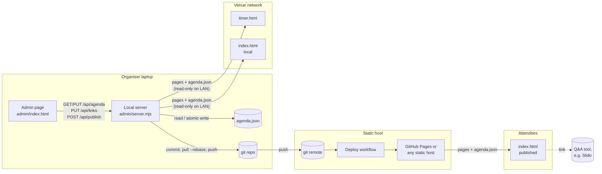
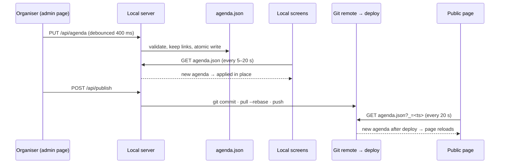

# OnAir: implementation

This document covers what OnAir does, how it's put together and how each part works. For setup and the
`agenda.json` reference, see the [README](../README.md). For the scheduling rules and a consistency check,
see [AGENTS.md](../AGENTS.md).

OnAir is a set of static web pages built around one data file, `agenda.json`. Two public pages read it:
a live agenda for attendees (with a presentation mode for the room) and a timer for speakers. A small local admin tool
edits it, and `onair.sh` runs it. Everything is plain HTML, CSS and JavaScript plus a Node.js server with no
dependencies, and there's no build step.

## Contents

1. [Functionality inventory](#1-functionality-inventory)
2. [Architecture](#2-architecture)
3. [Data model](#3-data-model)
4. [Implementation notes](#4-implementation-notes)
5. [Timing and refresh parameters](#5-timing-and-refresh-parameters)
6. [Known limitations](#6-known-limitations)
7. [File map](#7-file-map)

---

## 1. Functionality inventory

### 1.1 Live agenda (`index.html`)

For attendees on their phones and laptops. The page can also be shown on a shared screen.

| Feature | What it does |
|---|---|
| Event countdown | Before the event: days, hours, minutes and seconds to the first session, the date and venue, and the start time in the viewer's own time zone if it differs. |
| Live status hero | During the event: what's on stage, the speaker, a progress bar whose striped end marks the Q&A, the time range and minutes left. Labels switch between "On stage now", "Q&A now", "Coffee break" and "Lunch break". |
| Changeover state | Between a talk and the next speaker: "Up next" with a countdown to the next start. |
| Up next card | The next session and how many minutes until it starts. |
| Wrap-up state | After the event: "That's a wrap" and a thank-you. |
| Agenda list | Every session, grouped under act headings (the label is configurable), with times, the talk/Q&A split, description, speaker and role. Breaks are drawn differently. |
| Session states | Past sessions fade and get a ✓. The current one is highlighted and shows "On stage now" or "Q&A now" with a progress line. The next one is tagged "Up next, in N min". |
| Follow the live session | A toggle (on by default) that scrolls the current session into view when it changes. A floating "Jump to now" button appears when the current session is off screen. |
| Sticky header strip | Once the hero scrolls away, a compact strip in the sticky header keeps showing the current session, a progress bar, minutes left and what's next (or the countdown before the event). |
| Ask a question | Buttons in the header, in the hero's link bar, during Q&A, and on each talk. They open `links.qa` in a new tab, like Watch live. Hidden when `links.qa` is empty. |
| Watch live | Buttons in the header and the hero's link bar, opening `links.stream` in a new tab; hidden when empty. On phones the header keeps only "Ask", and the link bar carries both. |
| Configurable texts | `labels` overrides the button texts, the act label and the QR caption (e.g. for another language). |
| Presentation mode | For a projector or TV (`P`, the "Present" button or `?mode=present`): a full-bleed layout with the event logo and a large clock, a QR code generated at runtime from the Q&A link (`links.qa`) with a configurable caption, and the next four sessions. Controls fade out when the mouse is idle, `F` toggles full screen, and a wake lock keeps the screen on. |
| Animated terminal | A two-line terminal in the hero. **Between talks** (changeovers, breaks, before/after) it loops: types the init command (correcting its argument a few times), prints `initializing next talk… ✓` and the next talk, runs one funny command from `cli-commands.json` (42 commands, each with an output line), and prints `exit 42`. **When a talk starts** it types `onair run "<talk>"`, prints `loading talk… ✓` with the presenter, then keeps the talk and presenter on screen with a status line: time left, a warning in the last 5 minutes, "Q&A is open", and the last minute. Configured by `cli`; static when the viewer has turned off animations or `cli.enabled` is false. |
| Branding | `theme` picks a palette from `themes.mjs` (Midnight, the blue one, by default; Ocean, Forest, Ember, Grape, Graphite), or holds a custom palette (e.g. generated from artwork in the admin), and can override single colours. Accent-tinted surfaces follow the palette. `event.logo` replaces the pixel mark in the header and presentation mode. `brand` sets the header wordmark. |
| Test mode | Rehearse any moment: `?sim=HH:MM[:SS]` (or `?sim=YYYY-MM-DDTHH:MM`) with optional `&speed=N`, or the "Test the live view" dialog with a time slider, shortcut chips, clock speed and pause. A banner shows test mode is on; `&quiet` hides it. |
| Auto-refresh | Re-checks the agenda and the page itself every 20 s and reloads when either changed. It holds the reload while a dialog is open, someone is typing or the page is full screen (agenda changes still apply in place meanwhile). It keeps scroll position, the follow setting and the test-mode clock across reloads. |

### 1.2 Speaker timer (`timer.html`)

A confidence monitor for the speaker: a huge countdown on a near-black screen.

| Feature | What it does |
|---|---|
| Talk countdown | Counts down the talk part of the current talk (the slot minus its Q&A). |
| Alerts | Digits turn amber at 5 min, orange at 2 min and pulsing red in the last minute. A "5 MIN LEFT", "2 MIN LEFT" or "LAST MINUTE" banner shows for 8 s as each mark is crossed. |
| Stop alarm | When the talk part ends, the whole screen blinks red and black: "STOP · Time for Q&A" with the Q&A time, for 20 s. |
| Q&A countdown | Then the Q&A counts down, with the same alerts. |
| Time's up | When the slot ends: a blinking "TIME'S UP · Please wrap up" with an overtime counter (+m:ss) for 30 s. |
| Other states | Changeover ("NEXT", the next speaker and a countdown), breaks (a calm countdown to "back at"), keynotes (alerts, no Q&A), and before and after the event. A footer line shows the session after this one. |
| Rehearsal and upkeep | `?sim`, `&speed`, `&quiet`. `F` for full screen, wake lock. Agenda changes apply in place every 5 s (local agenda) or 15 s (remote). Page updates reload unless full screen. The palette's accent colours the talk chip, calm states and "next". |

### 1.3 Admin (`admin/index.html` + `admin/server.mjs`)

Runs on the organiser's laptop: `node admin/server.mjs`, then http://localhost:4242/admin/.

| Feature | What it does |
|---|---|
| Live control | Event-time clock, a "Now" card (current session, time left, progress) and a "Next" card. **"Started late? Start it now"** moves the current session to the current minute. **"Start … now"** starts the next session early. Both shift everything after it. |
| Decision panel | Part of the sticky header, so it is always visible: the clock, what's on now with time left and a progress line, and three moves. **+5 min talk…** (only in the last 5 minutes of the talk part) and **+5 min Q&A…** (only during Q&A) extend the running talk; **−5 min from…** wins time back. A disabled button says when it becomes available. |
| Borrow picker | Opened by those moves. Lists every remaining session with its start and length, and previews the change: start times and lengths that move are shown old → new, plus the day's new end. Pick the slot that gives up the minutes (5, 10 or 15): a talk that hasn't started (its talk part shrinks, never below 5 min; the Q&A stays) or a coffee break or lunch that hasn't ended (never below 5 min). Slots that can't lend say why. When extending, "Don't borrow" lets the rest of the day run later. The preview runs the real re-flow on a copy of the agenda. Apply makes one undoable change and publishes like "Start it now". |
| Catch-up option | "Take a delay out of the next break" shortens the next break by the delay (keeping at least 5 min) so later sessions stay on time. |
| Publish right away | Option (on by default) to publish live-control changes immediately. |
| Clear all delays | Snaps every session back to back (plus changeovers). |
| Pretend time | "Pretend it's HH:MM" to rehearse the live control. |
| Session editing | Start time, minutes, Q&A minutes (talks), type (talk, break, keynote), title, speaker, act, role and description, plus add (talk, coffee break, lunch, keynote) and delete. |
| Reordering | Drag ⠿ to reorder, or use ↑/↓. Times re-flow automatically, and a moved talk takes the act of the talks around it. |
| Hints | Per row: "+N min delay", the talk/Q&A split, "then 5 min changeover", and warnings for odd break titles or a Q&A that fills the slot. |
| Links & QR code | The two links (the Q&A link, used by the Ask buttons and the QR code; and the livestream), plus the QR caption and the button texts. Links save through their own route (`PUT /api/links`). |
| QR code generator | Previews the QR code the presentation screen uses (the Q&A link), or one for any URL typed in, and downloads it as SVG (vector, for print) or a ~1024 px PNG; "Copy link" copies the URL. Uses the same encoder as the public pages. |
| Branding | Event name, header title and tag, city and logo (with a preview on the dark header); palette swatches for the six presets, colour pickers for single overrides, and a reset to the palette (or back to Midnight from a custom one). |
| Palette from an image | Drop or choose an image (or analyse the event logo): dominant colours are detected in the browser and turned into a readable palette, with a live preview; click a colour to make it the accent; "Apply" saves it as a custom theme. |
| Event settings | Event date, UTC offset, talk, Q&A and changeover minutes, and act names. |
| Undo / redo | Up to 200 steps, ⌘Z / ⇧⌘Z (Ctrl+Z / Ctrl+Y). |
| Saving | Every change saves to the agenda file (debounced 400 ms). The status shows saving, saved, the number of unpublished changes, or errors. |
| Publish | Commits the agenda file with a message built from the change labels, pulls with rebase and pushes. |
| Outside changes | Re-reads the agenda every 3 s while idle and adopts changes made elsewhere (another tab, a pull, a hand edit) instead of overwriting them. |
| Open screens | Header buttons open the Agenda, Presentation mode and Speaker timer in new tabs; while "Pretend it's" is on they open at that moment (`?sim=`). The **Screens** panel lists each screen's address on the local network with Open, Copy and a QR code to scan from a tablet or the projector computer. |

### 1.4 Hosting

| Feature | What it does |
|---|---|
| Static hosting | The two pages, `agenda.json`, `themes.mjs`, `cli-commands.json` and `vendor/` work on any static host. `.github/workflows/pages.yml` deploys to GitHub Pages on every push to `main`. A newer push cancels an older deploy still in progress, and stuck deploys time out after 10 minutes. |
| Local network serving | The local server listens on all interfaces. Screens on the venue network open the pages and `agenda.json` read-only via the address it prints. The admin page and API answer only to the machine running it. |
| Agenda source | Each page loads `agenda.json` from whichever host serves it. `?agenda=<url>` overrides this. |
| Run script | `./onair.sh` starts, stops, restarts and reports on the server in the background (PID and log in `.onair/`), opens the pages in a browser, changes the port, and checks prerequisites, from an interactive menu or as direct commands. If another program holds the port, it asks before stopping it. |

---

## 2. Architecture

### 2.1 Components



### 2.2 Design principles

- **One source of truth.** Every page derives everything (times, states, labels, links, colours, QR code) from `agenda.json` at runtime. Nothing about a specific event is hard-coded in the HTML.
- **Static first.** The public side is plain files: no backend, no build, and no runtime dependencies beyond Google Fonts (with system-font fallbacks) and whatever Q&A tool you embed. The only server is the optional local one.
- **Each page stands alone.** Each page is one HTML file with inline CSS and a single `<script type="module">`. The small amount of shared page logic (fetching, the time model, auto-refresh) is duplicated on purpose so any page can be copied, opened or fixed in isolation. Shared files hold only data and leaf helpers: `themes.mjs` (palettes), `cli-commands.json` (the terminal's inventory) and the vendored QR encoder.
- **Pull, not push.** Pages poll for changes. There are no websockets and no server-sent events, so the same code works on a static host or the local server.
- **Clock-driven state.** All visible state is computed from "now" and the agenda on every tick. Nothing depends on event history, so a reload, a late join or a schedule change mid-session always shows the right state. That's also what makes the simulated clock (`?sim`) possible.

### 2.3 Two ways to run

| | Published (static host) | Local (`node admin/server.mjs`) |
|---|---|---|
| Who uses it | Attendees anywhere | Room screens, organiser |
| Agenda source | `https://<host>/agenda.json` | `http://<laptop>:4242/agenda.json` |
| How a change arrives | Admin **Publish** → git push → deploy (30 s to minutes) → poll | Admin save → file on disk → poll (seconds) |
| Depends on | The host and its deploy pipeline, internet | The laptop and the venue network (the Q&A tool still needs internet) |

The recommended event-day setup runs presentation mode and the speaker timer from the local server (fast, no deploy)
and lets attendees use the published page.

### 2.4 Change propagation



---

## 3. Data model

### 3.1 `agenda.json`

The [README](../README.md#agendajson) has the full annotated example. Top-level blocks:

| Block | Required | Purpose |
|---|---|---|
| `event` | yes | `name`, `date` (YYYY-MM-DD), `timeZone` (IANA), `utcOffset` (`+HH:MM` on that day). Optional: `brand` (`title`, `number`), `logo` (image URL or path), `city`, `timeZoneNote`, `venue`, `dateText`, `organizer`. |
| `timing` | yes | `talkMinutes`, `qaMinutes`; optional `changeoverMinutes`. |
| `sessions` | yes | The schedule, in order. |
| `links` | no | `qa` (the one Q&A link: Ask buttons, QR code) and `stream`. An empty or missing link hides its buttons and panels. |
| `acts` | no | `{ "1": "Act title", … }` for the headings. |
| `theme` | no | `preset` (a palette from `themes.mjs`; default `midnight`; `custom` for a palette of your own) plus optional `ink`, `navy`, `accent`, `accentInk`. Explicit colours override the preset's; an unknown preset falls back to Midnight. The admin's image generator also writes `source: "image"`. |
| `labels` | no | `act`, `ask`, `watch`, `qrTitle`, `qrNote`: texts for buttons, act headings and the QR caption. |
| `cli` | no | The terminal: `command`, `answer`, `guesses`, `jokes` (`true` = `cli-commands.json`), `exitCode` (default 42), `enabled`. |

### 3.2 Derived values (computed by every page)

| Value | Formula |
|---|---|
| Event-day midnight | `DATE0 = Date.parse(date + "T00:00:00" + utcOffset)` |
| Session start/end instants | `from = DATE0 + minutes(start)`, `to = from + dur` |
| Q&A minutes of a talk | `qa ?? timing.qaMinutes`, clamped to `[0, dur]` (0 for breaks and keynotes) |
| Q&A start | `to − qa` (the talk part is the rest of the slot) |
| Event start/end | first session's `from`, last session's `to` |
| Current / next session | first with `from ≤ t < to` / first with `from > t`; neither current nor next is a changeover gap |

Times are stored as event-local `HH:MM` and turned into absolute instants with the fixed `utcOffset`. Display uses
`Intl.DateTimeFormat` with `timeZone`, so every viewer sees event time, and the agenda adds a note with the
viewer's local time.

### 3.3 Scheduling model (admin)

The admin keeps sessions back to back, with a **changeover gap** after a talk unless a break follows
(`timing.changeoverMinutes`). The gap is not a session; it exists only between two `start` times.

To survive live adjustments, each session also carries an implicit **slack**: how far it starts after its
"natural" slot.

```
slack(i) = start(i) − (end(i−1) + changeover(i−1, i))      // ≥ 0
```

Every edit goes through one pipeline: snapshot for undo, record each session's slack, apply the change, then
**re-flow**: walk the list and set `start(i) = end(i−1) + changeover + slack(i)`. Because slack travels with the
session object, a real delay ("Start now" at 10:58 for a 10:54 talk) survives unrelated edits elsewhere. Explicit
operations reset it: dragging a session clears its slack, and "Clear all delays" clears everyone's.

- **Start now / set start time (`startAt`).** If the new start is later than the natural slot, it becomes slack. If it's earlier, the previous session is shortened. With catch-up on, the delay is then taken out of the next break (down to 5 min).
- **Change duration.** Re-flow shifts everything after it, keeping each session's slack.
- **Reorder.** Splice, clear the moved session's slack, re-assign the act of a moved talk, re-flow.

---

## 4. Implementation notes

### 4.1 Shared page patterns

Both public pages follow the same skeleton:

1. **Resolve the agenda URL.** `?agenda=` if given, otherwise the relative `agenda.json`, so it comes from whichever host serves the page. Pages opened from disk (`file://`) can't fetch it and show a hint to serve the folder.
2. **Load before rendering.** A top-level `await` fetch in a module script, which also imports `themes.mjs` (and the agenda page `vendor/qrcode.mjs`). On failure the page shows a clear message (the timer retries on its own).
3. **`setData(agenda)`.** Derives instants and per-talk Q&A (§3.2), applies the theme and assigns module-level bindings (`EV`, `SESSIONS`, `EVENT_START`, …). Calling it again with new data is how live updates are applied in place.
4. **Theming.** `applyTheme()` from `themes.mjs` resolves the palette (preset, then explicit colours) and sets four CSS variables (`--ink`, `--navy`, `--mint`, `--mint-ink`). Every accent-tinted surface is written as `color-mix(in srgb, var(--mint) N%, transparent)` rather than a fixed rgba, so tints follow any palette.
5. **Tick loop.** `setInterval(tick, 200–250 ms)`. `tick()` reads `now()`, finds the current and next session, and writes text and styles. DOM writes are idempotent; lists only re-render when their HTML string changes.
6. **Simulated clock.** `now()` returns `sim.base + (performance.now() − sim.anchor) × speed` in test mode, otherwise `Date.now()`. Everything time-based goes through `now()`, so test mode exercises the real code paths.
7. **Cache-busting fetches.** Every poll fetches `url?_=<timestamp>` with `cache: "no-store"`, bypassing both the browser cache and CDN caches (GitHub Pages caches for up to 10 min).
8. **Self-update.** On each poll a page also fetches its own HTML and compares a simple 32-bit string hash with the baseline from load. A change means a new version is deployed, so the page reloads at the next safe moment.
9. **Screen upkeep.** Screen Wake Lock (re-acquired on visibility change), Fullscreen API toggles, auto-hiding controls and cursor on the display pages, and `prefers-reduced-motion` respected for blinking and pulsing.

### 4.2 Live agenda

- **Phases.** `before`, `live` and `after` come from the event start and end. Within `live`: a current session (talk part, Q&A, break or keynote), or a **changeover** when nothing is current but something is next. The hero, mini strip, Up next card, agenda states and presentation view all branch on the same values.
- **Agenda rendering.** `renderAgenda()` rebuilds the list from `SESSIONS`, inserting an act heading when `act` changes. Row ids `s<i>`, `st<i>` and `pg<i>` are targeted by `tick()`. It also applies the links (hiding buttons without one, and filling the hero's link bar), labels, event text, logo and QR code.
- **QR code.** `renderQr(url)` uses the vendored encoder (`vendor/qrcode.mjs`, error correction level M) and draws one SVG path of horizontal runs with a 4-module quiet zone. It only redraws when the URL changes.
- **Follow-live scrolling.** Tracks the focused index (current, otherwise next) and scrolls it into view only when it changes, so it never fights the viewer's own scrolling. "Jump to now" appears when that row is off screen. `scroll-padding-top` accounts for the sticky header.
- **Sticky strip.** An `IntersectionObserver` on the hero toggles `body.scrolled`, which reveals the compact strip in the sticky header.
- **Presentation mode.** A `body.present` class switches the layout (CSS only) and enables the clock, QR tile and upcoming list. The mode lives in the URL (`?mode=present`) so it survives reloads.
- **Auto-reload.** `checkForUpdates()` every 20 s and on tab focus. If the agenda or page changed and it is safe (no open dialog, not typing, not full screen), it saves `{scrollY, follow, sim}` to `sessionStorage` and reloads. The restore is honoured within 60 s. Otherwise it applies the new agenda in place and reloads once the blocker is gone (on dialog close, focus out or full-screen exit).
- **Terminal loop.** A two-line scrollback (`lines.slice(-2)`) rendered into two fixed-height rows, so it never shifts the layout. The main loop alternates two scenes. The **break scene** (init command, next talk, one joke, `exit 42`) runs while nobody is on stage; each of its `sleep()` steps checks the clock and throws a sentinel the moment a talk starts, abandoning the scene mid-way. The **talk scene** types `onair run "<talk>"`, shows the presenter, then redraws the talk and a status line every second (time left; ≤5 min and last-minute warnings; Q&A open and its last minute) until that session ends. The joke inventory is fetched from `cli-commands.json` into an array filled in place, and the joke is picked when it's needed, so the first loop already has one. The `cli` block is re-read every loop. The element is `aria-hidden`, because the hero is an `aria-live` region.

### 4.3 Speaker timer

- **State machine** (evaluated every 200 ms): before → talk part → (Q&A start + 20 s: STOP alarm) → Q&A → (slot end + 30 s: TIME'S UP alarm) → changeover/next → … → done. Breaks and keynotes are handled separately.
- **Stateless alerts.** The alert level is derived from the time left (≤5, ≤2, ≤1 min). The "N MIN LEFT" banner shows while `threshold − 8 s < left ≤ threshold`, so it appears correctly after a reload or a schedule change, with no event history.
- **Digit fitting.** The countdown's character count sets `--len`, and `font-size = min(92vw / (len × 0.6), 58vh)` keeps `35:00` and `1:02:03` within the screen.
- **Updates.** Polls every 5 s when the agenda is on localhost, else 15 s, and always applies in place so full screen is never interrupted. Page updates reload only outside full screen.

### 4.4 Admin page

- **State.** `A` (the agenda being edited), `undoStack`/`redoStack` (JSON snapshots), `pending` (change labels since the last publish), `synced` (the JSON last read or written, used to detect outside changes), and `clockOffsetMs` ("Pretend it's").
- **Edit pipeline.** `edit(label, fn, {publish, rerender})`: snapshot, slack map, apply `fn`, re-flow, record the label, schedule a save, render. Text-only edits skip the re-flow.
- **Rendering.** A full re-render of the rows on structural changes. Expanded rows are remembered with a `WeakMap` from session object to key. The live panel re-renders every second, and the event settings form isn't re-rendered while focused.
- **Drag and drop.** Native HTML5 drag and drop. A row is `draggable` only while its handle is pressed, so text in the inputs stays selectable. A drop marker before or after the target row is based on the cursor's position.
- **Saving.** Debounced 400 ms `PUT /api/agenda`. Live-control actions save immediately and, if enabled, publish.
- **Links.** The Links panel flushes any pending save, then calls `PUT /api/links`, adopts the links the server returns and marks the change as unpublished. Undo and redo keep the current links, because links aren't part of the edit history.
- **Branding.** Name, header title and tag, city and logo are ordinary edits (nested paths such as `event.brand.title`; clearing a field removes it). The palette swatches come from `themes.mjs`, loaded with a dynamic `import()` at start-up so the admin and the pages share one definition. Picking a swatch writes `{ preset }`; a colour picker adds a single override; a custom palette is `{ preset: "custom", … }`.
- **Palette from an image.** The image (a local file read as a data URL, or the logo URL loaded with `crossOrigin="anonymous"`, which only works if its site allows it) is drawn onto a canvas of at most 96 px; transparent pixels are skipped. k-means (k = 6, k-means++ seeding with the mean as the first centre, 12 iterations) in RGB gives the dominant colours; those under 2% are dropped. The palette: the background takes the darkest substantial colour's hue (or the main colourful hue) at low lightness, darkened until white text has at least 12:1 contrast; the secondary is the same hue lighter; the accent is the chosen colour, or the most vivid substantial one, lightened until it has 4.5:1 against the background; the accent-on-light is darkened until it has 4.5:1 on the light page. Greyscale artwork gets a neutral slate and the default accent. Image loading uses the `load` event rather than `img.decode()`, which can stall in background tabs.
- **QR code generator.** Loads `vendor/qrcode.mjs` with a dynamic `import()` on first use, renders the matrix as one SVG path of horizontal runs (4-module quiet zone, black on white), and builds the PNG on a canvas at a whole number of pixels per module so edges stay sharp. A typed URL is a local override and is never saved to the agenda.
- **Outside changes.** `syncFromDisk()` every 3 s and on tab focus, skipped while editing, saving or publishing. If the file differs from `synced`, it adopts the file, clears undo/redo and shows a notice. This stops an idle tab from later writing a stale copy back.

### 4.5 Local server

Node.js with no dependencies (`http`, `fs/promises`, `child_process`, `os`, `path`, `url`).

| Route | Access | Purpose |
|---|---|---|
| `GET /`, `/index.html`, `/timer.html` | anyone on the network | The public pages |
| `GET /vendor/qrcode.mjs`, `/themes.mjs`, `/cli-commands.json` | anyone on the network | QR encoder, palettes, terminal inventory |
| `GET /agenda.json` | anyone on the network | Current agenda (read-only) |
| `GET /admin/` | this machine | Admin page (`/admin` redirects) |
| `GET /api/agenda` | this machine | Agenda for the admin |
| `PUT /api/agenda` | this machine + admin header | Validate and save (keeps the links on disk) |
| `PUT /api/links` | this machine + admin header | Change links (`qa`, `stream`; empty or http(s) URLs only). Older separate links (`qr`, `qrUrl`, `wall`) are dropped on save. |
| `POST /api/publish` | this machine + admin header | Commit, pull --rebase, push |
| `GET /api/status` | this machine | Branch, unpushed commits, dirty state (`{git:false}` outside a repo) |
| `GET /api/addresses` | this machine | The port and LAN addresses other devices can use (for the Screens panel) |

- **Access control.** Public routes are a fixed list of read-only GETs. Everything else requires a loopback remote address **and** a local `Host` header (which also blocks DNS-rebinding). Write requests also need `X-Agenda-Admin: 1`: a custom header triggers a CORS preflight that the server never approves, so other websites can't forge writes. `HOST=127.0.0.1` keeps the whole server local.
- **Saving.** Validates the agenda's shape (event name, date and offset formats, timing numbers, a safe `event.logo`, and each session's start, duration, kind, title and `qa` range). It **keeps `links` from the file on disk**: links change only through `PUT /api/links` (the admin's Links panel), so a tab left open across a link change can't write stale links back. It writes to a temp file and renames it, so the agenda is never half-written.
- **Publishing.** Calls are queued so concurrent clicks never race on git. It checks that the agenda file is inside the repository and that the remote exists, commits only the agenda file with the change labels as the message, then pulls with rebase and autostash before pushing to the current branch (or `BRANCH` on `REMOTE`).
- **Configuration.** `PORT`, `HOST`, `AGENDA_FILE`, `BRANCH`, `REMOTE`. On start it prints the localhost and LAN addresses for each page.

### 4.6 Deployment workflow

`.github/workflows/pages.yml` runs on push to `main` (and manually): checkout → configure-pages → upload the
repository as the Pages artifact → deploy-pages. `concurrency: pages` with `cancel-in-progress: true` makes the
newest push win, and a cancelled deploy leaves the previous version live. `timeout-minutes: 10`. In the
repository's Pages settings, set **Source** to **GitHub Actions**; with "Deploy from a branch", GitHub also runs
its own build next to this workflow and the two cancel each other.

---

## 5. Timing and refresh parameters

| Where | Parameter | Value |
|---|---|---|
| Live agenda | Render tick | 250 ms |
| Live agenda | Agenda and page-version check | 20 s, plus on tab focus |
| Live agenda | Reload state restore window | 60 s |
| Speaker timer | Render tick | 200 ms |
| Speaker timer | Agenda check | 5 s (local agenda) / 15 s (remote) |
| Speaker timer | Alert thresholds / banner / STOP / TIME'S UP | 5, 2, 1 min / 8 s / 20 s / 30 s |
| Terminal | Talk-scene status refresh / end-of-talk warning / last-minute notice | 1 s / 5 min / 1 min |
| Terminal | Break scene (typing, init, next talk, joke, exit) | about 15–20 s per loop |
| Admin page | Save debounce / live panel / outside-change check | 400 ms / 1 s / 3 s |
| Admin page | Image analysis size / clusters / minimum share | 96 px / 6 / 2% |
| Admin page | Undo depth / minimum break when catching up | 200 / 5 min |
| Agenda | Talk / Q&A / changeover defaults (demo) | 35 / 7 / 5 min |
| Deploy | Concurrency / timeout | newest push wins / 10 min |

---

## 6. Known limitations

- **Slido host views.** Attendees need Slido's audience link (`app.sli.do/event/<id>`), which works without a login. Host views such as `admin.sli.do` are for the organiser, not for the Ask buttons.
- **Deploy latency.** Changes to the published page depend on the host's deploy pipeline (GitHub Actions can take minutes when it's busy). Run room screens from the local server so they don't depend on deploys.
- **Every Publish is a push** and triggers a deploy. Rapid publishing queues and cancels deploys, so batch edits.
- **Old admin tabs.** The admin adopts outside changes and the server protects `links`, but a tab still running an older version of the admin page can publish an outdated *schedule*. Reload admin tabs after updating OnAir.
- **No authentication.** Admin access is "the machine running the server". Anyone with access to that laptop can edit and publish.
- **One day, one offset.** `utcOffset` must match daylight saving on the event day. Multi-day or DST-crossing events would need per-day offsets.
- **Browser support.** The pages use ES modules, `<dialog>`, CSS container queries and `color-mix()`: current Chrome, Edge, Safari and Firefox (roughly 2023 onwards). Older browsers show untinted surfaces or may not run the page.
- **Logo analysis across sites.** "Analyse the event logo" can only read a logo hosted elsewhere if that site allows it (CORS). Otherwise download the image and drop the file in.
- **Single track.** The model is one stage with one sequence of sessions. Parallel tracks would need a track dimension in the data and the views.
- **The admin is published too.** The deploy workflow uploads the whole repository, including `admin/`. That's harmless, because without the local server it can't change anything.

---

## 7. File map

| Path | Role |
|---|---|
| `agenda.json` | Event data, the single source of truth (demo event) |
| `index.html` | Live agenda + presentation mode |
| `timer.html` | Speaker timer |
| `admin/index.html` | Admin and live-control UI |
| `admin/server.mjs` | Local server: pages, agenda API, LAN access, git publishing |
| `vendor/qrcode.mjs` | QR Code Generator by Kazuhiko Arase (MIT) |
| `themes.mjs` | The colour palettes and the code that applies them (shared by all pages and the admin) |
| `cli-commands.json` | The terminal's inventory of 42 funny commands, each `{ "cmd", "out" }` |
| `onair.sh` | Run script: interactive menu and `start`/`stop`/`restart`/`status`/`logs`/`run`/`setup` |
| `.github/workflows/pages.yml` | GitHub Pages deployment |
| `docs/` | Screenshots (`docs/themes/` has one per palette) and this document |
| `README.md`, `LICENSE` | Setup and reference; MIT licence |
| `AGENTS.md` | Scheduling rules and a consistency check, for people and AI agents editing the agenda |
